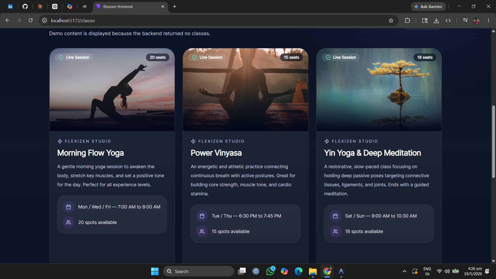
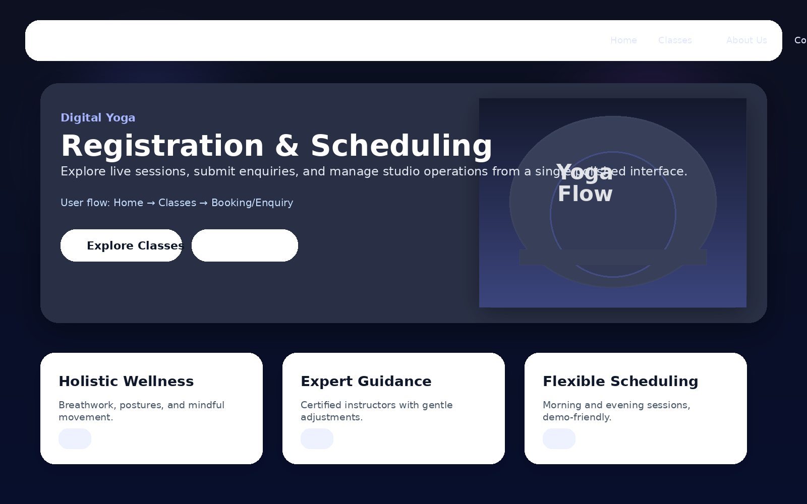
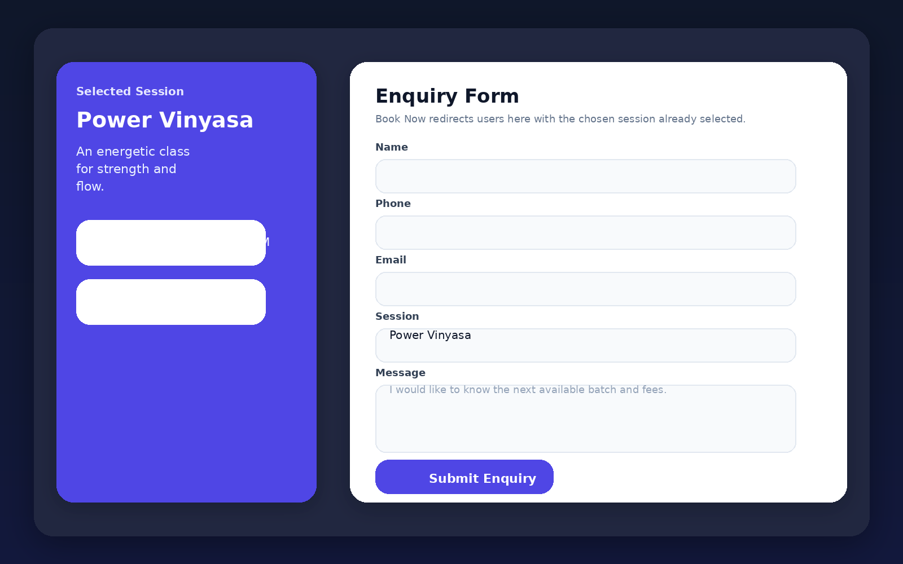
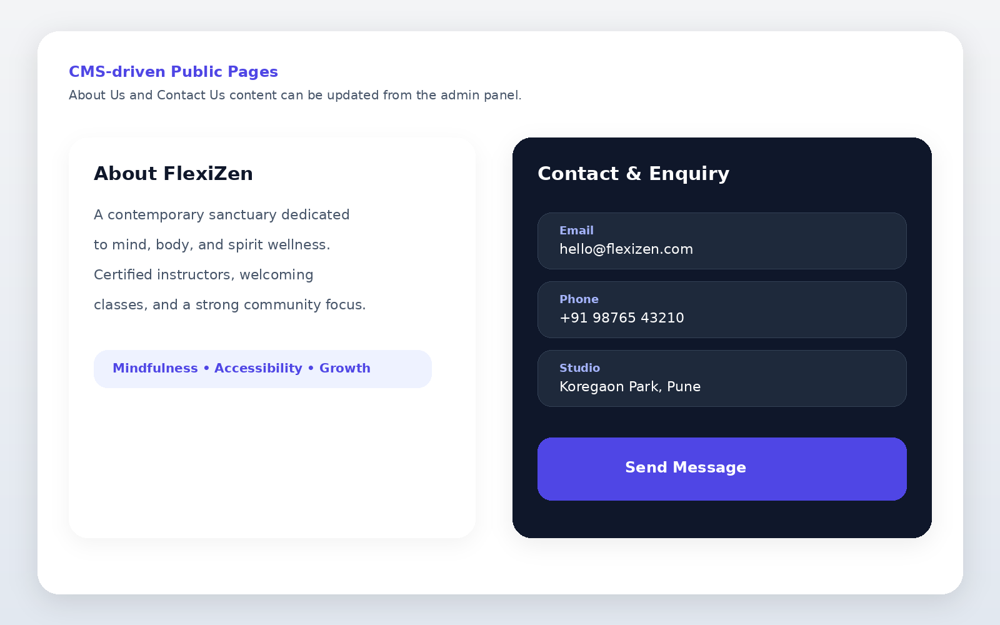
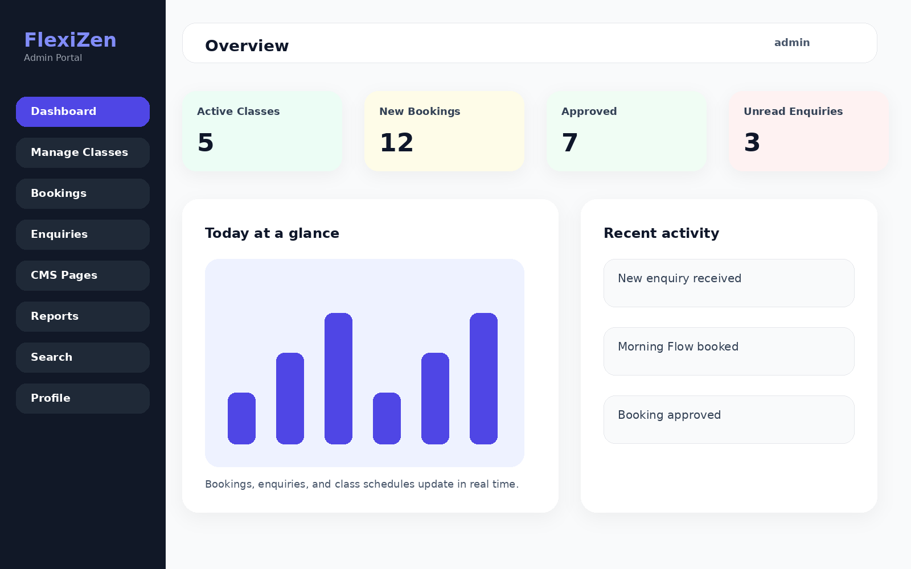
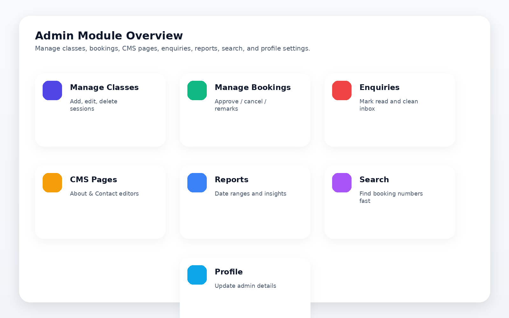

# FlexiZen — Project README

## Overview
FlexiZen is a digital yoga registration and scheduling system with a public user experience and a protected admin panel.

The current frontend includes:
- a polished landing page with hero content and CTA buttons
- a classes listing with session cards and booking flow
- a booking/enquiry flow that carries the selected session forward
- CMS-driven About and Contact pages
- an admin login and admin dashboard
- admin modules for classes, bookings, enquiries, pages, reports, search, and profile settings

## What was verified in this environment
- Frontend production build: `npm run build` ✅
- Frontend lint check: `npm run lint` ✅

## How to run the project

### 1) Backend
Requirements:
- Java 17
- Tomcat 10
- PostgreSQL

Steps:
1. Create the PostgreSQL database used by the project.
2. Update the datasource settings in `flexizen-backend/src/main/webapp/WEB-INF/applicationContext.xml` if your local database credentials are different.
3. Deploy the generated WAR from `flexizen-backend/target/flexizen.war` to Tomcat 10.
4. Start Tomcat.

Default admin credentials from the seed data:
- Username: `admin`
- Password: `Admin@123`

### 2) Frontend
```bash
cd flexizen-frontend
npm install
npm run dev
```

Open the app at:
- `http://localhost:5173`

### 3) Optional frontend checks
```bash
npm run build
npm run lint
```

## Main features

### User side
- Home page with a premium hero section
- Classes page with session cards and booking CTA
- Booking / enquiry flow with selected session transfer
- Session dropdown in enquiry form for direct selection
- About Us CMS page
- Contact Us CMS page with enquiry submission

### Admin side
- Admin login
- Dashboard with KPI cards and recent activity
- Manage Classes
- Manage Bookings
- Enquiries inbox
- CMS Pages editor
- Reports view
- Booking search
- Profile and password settings

## Preview gallery

> Note: the local browser automation in this environment blocks direct navigation to local URLs, so the gallery below uses one real frontend screenshot from the project plus preview renders created from the final UI layout.

### Classes page screenshot



### Home preview



### Booking / enquiry preview



### About / Contact preview



### Admin dashboard preview



### Admin modules preview



## Notes
- The frontend is built with Vite + React.
- The project uses Tailwind CSS for styling.
- The backend is Spring MVC / JPA / Spring Security based.
- The public pages are designed to keep working even when backend data is unavailable by falling back to demo content where appropriate.
